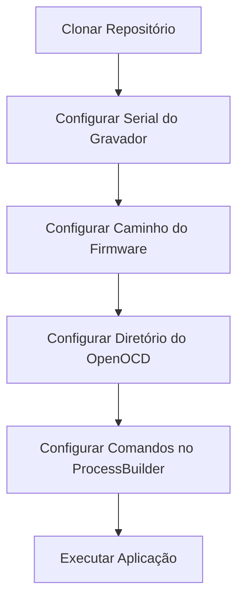
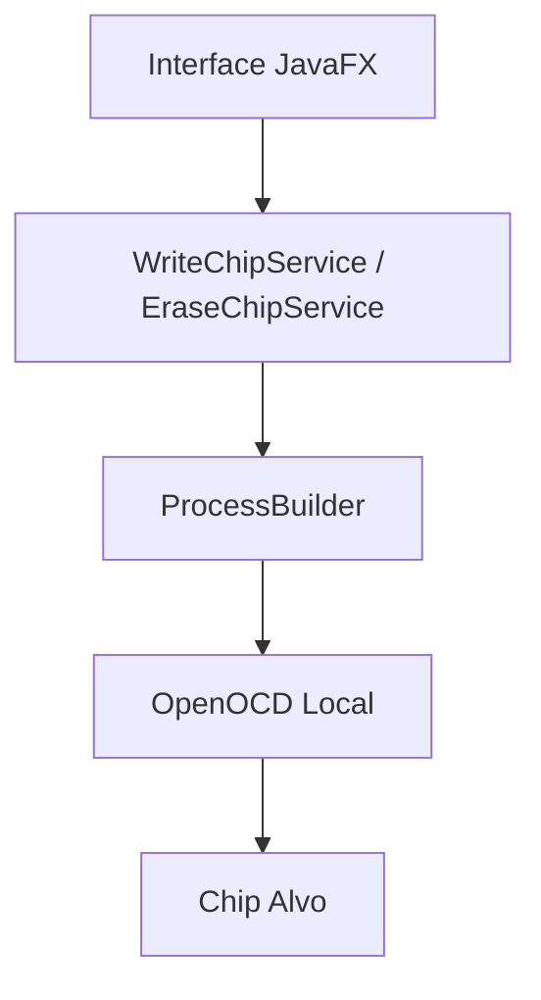

# Puya Chip Recorder

Ferramenta para gravação e apagamento de chips utilizando OpenOCD via interface gráfica em JavaFX.

---

## 🔄 Fluxo de Configuração



---

## 🏗 Arquitetura de Execução



---

## ⚙️ Configuração Obrigatória Após Clonar

Cada usuário deve configurar:

- ✔ Serial do próprio gravador
- ✔ Caminho do firmware local
- ✔ Diretório do OpenOCD instalado na máquina
- ✔ Comandos específicos do chip no ProcessBuilder

---

## 🚫 Não Versionar

Nunca commitar:

- Firmware (.hex, .bin, .elf)
- Número de série real de gravadores
- Caminhos internos de rede
- Scripts proprietários

Adicionar ao `.gitignore`:

```
*.hex
*.bin
*.elf
```

---